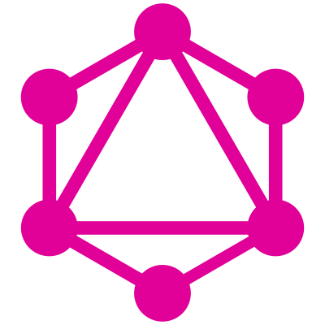

  

# Objetivo:

Realização de estudo referente ao graphQL, uma **linguagem de consulta API** criada pelo facebook que conta com vários benefícios na forma de consumir recursos de uma API.

Aqui será descrito sobre minha visão alguns benefícios que o graphQL pode ter se implementado de forma correta.
 
# Benefícios:

> 1° - O graphQL conta somente com uma requisição, tanto para buscar, criar, editar, etc... >enquanto API REST tradicional conta com rotas de requisição, dentre elas **`GET, POST, PUT, >DELETE`**, onde cada requisição dessa vai consumir recurso da aplicação. 
>
> 2° - Como o graphQL realiza somente uma requisição, a diferença está nos métodos >aplicados no corpo da requisição, que são:
>
> **Query** - Quando está buscando alguma informação.
> **Mutation** - Quando for criar, alterar ou deletar alguma informação. 
> **Subscription** -  Quando necessário de alguma informação realtime, pois no graphQL, já
> é implementado de forma automática.
>
> 3° - Interface visual para fazer queries, parecido com insomnia.
>
> 4° - Múltiplas alterações dentro da mesma requisição, pois é possível por exemplo, >alterar alguma informação de usuário e listar o mesmo logo em seguida, isso tudo dentro da >mesma requisição.
>
> 5° - Documentação de forma automática, com o schema.

## :memo: Licença

Esse projeto está sob a licença MIT. Veja o arquivo [LICENSE](https://raw.githubusercontent.com/kaiorr/graphql/master/LICENSE) para mais detalhes.

----

Feito com :heart: por **Kaio Ribeiro** :call_me_hand: [Professional-Network](https://www.linkedin.com/in/kaio-ribeiro-310123150/)